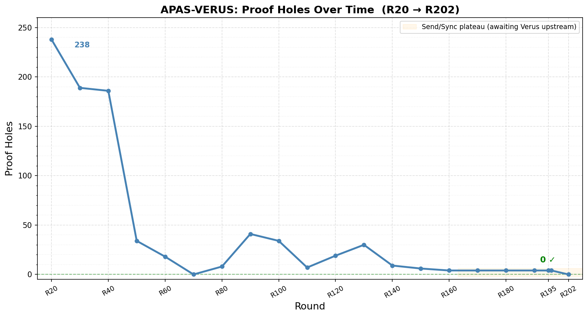
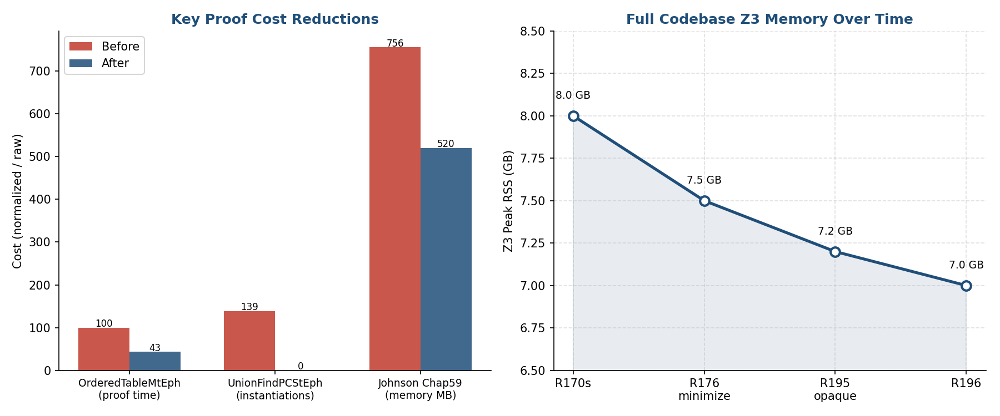

# APAS-VERUS: AI Paired Proof Engineering Techniques and Experience

- Brian G. Milnes <briangmilnes@gmail.com>
- Experience, Results and Techniques in building
- Algorithms Parallel and Sequential by Acar and Blelloch
- in Rust
- and then proving it in Verus.

# Outline of the talk

- Background
- Algorithms Parallel and Sequential (APAS)
- Rust      - The Good, The Bad and the Ugly
- APAS-AI   - AI Paired Programming APAS in Rust
- Rusticate - sending Python back to the family estate
- Verus     - Proving Rust
- Verus vs F*/Pulse

# Outline of the talk

- APAS-VERUS - AI Paired Proving APAS in Verus
- Veracity - Software Engineering AI Paired Proving
- Software Engineering in AI Paired Proving
- The AI Paired Programming Interfaces
- The Internet Apocalypse
- Review of the Talk
- Questions

# Background

- B.Sc. Applied Math (Computer Science)
- 2 years of AI PL development (Carnegie Group)
- 7 years of (symbolic) AI Research (Soar Group, CMU CS)
- 2 years of PL research (Fox Group, CMU CS) aimed at
 making type safe languages work in systems and networking.
- Founding member of Lycos - systems, performance, ran operations
- Early Amazon - systems, performance, operations
- M.Sc. Computer Science, University of Washington
- Early Zillow - 6th engineer, ran operations, systems, performance
- A general love of proving programs with Rocq, F* and now Verus.

# Algorithms Parallel and Sequential (APAS)

- I needed a practical, fairly large, very difficult task to learn Verus.
- Rocq is good but complicated and slow and I had used it manually and it's
    not close the the PL.
- F* is good, but complicated slow and I had used it manually, close to
      the PL but far from a practical PL and generates code.
- In fact some of the F* group went to work on Verus due to the
    requirement of 'heroic proof'.
- But I just missed the Pulse, so I suspect things are quite different now,
 except for the language gap and generation.

# Algorithms Parallel and Sequential (APAS)

- I chose to implement: Algorithms Parallel and Sequential (APAS) in Verus.
- Umut Acar and Guy Blelloch 2022
    - 121 algorithms!
    - 81 of which can be parallel.
    - 740 concepts.
- Similar to Swamy et al. and AIs implemented: "Introduction to Algorithms"
- by Thomas H. Cormen, Charles E. Leiserson, Ronald L. Rivest
- in Pulse, but bigger.

# Rust - The Good

- 20 year old PL
- Fast compilation, code.
- Industrial acceptance: AWS, Google, Huawei, Microsoft, and Mozilla.
- Linux Kernel now uses it!
- Linear typing plus borrowing! No GC!
- Clear mutability.
- Slicing! with ownership.
- Their 'cargo' package system works rather well.
- No objects for modularity! Good.

# Rust - The Bad

- No GC! Circular structures require GC and why not have it!
- No regions, just lifetime with end of scope deallocation which is slower.
- Translating C to Rust is hard to get it into linear logic + borrowing.
- However, you can (and I have) rewritten algorithms with a free list (that are right).
- Macros, with typing checked at use, which is not so good.
- Of the 94 technical terms in Rust, 4 or so are actual PL terms.
- No objects: object oriented was invented by Ivan Sutherland 1962!
- And it's great for what it was invented for: modeling the real world and interfaces.

# Rust - Typeclasses are a weak module

- You will pine for ML modules!
- The Rustaceans have decided that unless their module implements a typeclass at
  multiple types, they won't use it.
- Verus is now doing this also, but I abuse the notation to put all the specs
 together in APAS-VERUS for readability.

# Rust - The Really Bad — Ordering

| Property         | PartialEq | Eq  | PartialOrd | Ord |
|------------------|-----------|-----|------------|-----|
| Reflexive        |  NO!      | req |            | yes |
| Symmetric        | req       | req |            |     |
| Transitive       | req       | req | req        | req |
| Antisymmetric    |           |     | req        | req |
| Total            |           |     |            | req |
| Consistent w/ == |           |     |            |     |

# Rust - The Really Really Bad

- Copy is implicit, Clone is explicit
- clone() is a bitwise memory copy by default, but can be overridden.
- Copy requires the type to be entirely stack-resident.
- Clone has no such restriction — it can deep-copy heap data, open files,
     allocate new memory.
- Copy requires Clone — any type that implements Copy must also implement Clone,
      but not vice versa.
- So you have the optimized bit copy messing with the general copy you want.

# APAS-AI   - AI Paired Programming APAS in Rust

- APAS-AI is a nearly complete, idiomatic Rust implementation of
     the algorithms from Acar and Blelloch.
- Sequential and parallel variants throughout.
- Timeline: 347 commits over 88 calendar days (Aug–Oct 2025).
- 59 days of active development; 8 residual commits in November.
- I knew no Rust when I started.
- My AI had to teach it to me, which was harder than I thought as
  of the 94 terms used in the Rust language and docs, only 4 are
  real PL terms!

# APAS-AI   - AI Paired Programming APAS in Rust

- Scale:
    - 42 chapters
    - 238 source files
    - 45,485 source LOC.
- Tests:
    - 246 files
    - 55,223 LOC
    - 3,923 test functions
-  1.2× the source code size
- Benchmarks: 171 files, 13,890 LOC, 360 benchmark functions

# Rusticate - sending Python back to the family estate

- Webster's definition of rusticate:
    - 1. To go to or live in the country.
    - 2. (British) To suspend a student from a university, especially Oxford or Cambridge, as a
    disciplinary punishment.
- Rusticate is a suite of 89 tools, most obviated, for analyzing and transforming rust codebases.
- review tools, fix tools, metrics, and migration aids.
- Built because Python + regex cannot reliably parse Rust.
- The string hacking detector is the foremost valuable tool to fix
   any and all transformation of Rust.

# Verus: Verified Rust

- Verus is a tool for formally verifying Rust,
     developed at MSFT Research, VMware Research and Carnegie Mellon University.
- Team: Andrea Lattuada, Travis Hance, Chris Hawblitzel, Jay Lorch,
     Matthias Brun, Chanhee Park, Yi Zhou, Jon Howell, Bryan Parno.
- Goals: bring machine-checked proof to systems software written in Rust.
- Goals: tight integration with the programming language.
- Goals: easier faster proof.

# Key Verus Publications

- "Verus: Verifying Rust Programs using Linear Ghost Types"
     Lattuada, Hance, Cho, Brun, Subasinghe, Zhou, Howell, Parno, Hawblitzel
- "Verus: A Practical Foundation for Systems Verification"
     Lattuada, Hance, Bosamiya, Brun, Cho, LeBlanc, Srinivasan, Achermann,
     Chajed, Hawblitzel, Howell, Lorch, Padon, Parno
- "Verifying Concurrent Systems Code"
     Travis Hance — PhD Thesis, Carnegie Mellon University, 2024

# Verus

- Specifications are written in a pure mathematical sublanguage —
     spec functions, forall/exists, arithmetic, sets, sequences.
- Z3 handles linear arithmetic, arrays, and quantified formulas,
     but quantifier instantiation requires explicit trigger annotations.
- But there is also a faster linear arithmetic solver.
- Decidability is not guaranteed.
- Annotates existing Rust code                                                                         - spec / proof / exec mode split
- Ships the Rust binary directly
- Linear Logic + Borrowing from the Rust type system, which rustc checks.

# F* - Comparison

- Stand-alone dependently-typed language
- Effect system (Pure, ST, Steel/Pulse)
- SMT + tactics (meta-programming)
- Extracts to OCaml, F#, C, Wasm                                                                       - Separation logic via Steel Pulse for low-level code.
- Refinement types.
- A much richer language set.

# Views and the Libraries

- A View maps an executable Rust type to a mathematical ghost type:
     Vec<T> views as Seq<T>,  HashSet<K> views as Set<K::V>.
     Specs are written over the view; exec code manipulates the real type.
- vstd is Verus's standard library — specs for Vec, Seq, Set,
     Map, Multiset, arithmetic, and common lemmas.
- vstdplus is APAS-VERUS's extension library.
- Ghost types (Seq, Set, Map, Fn) live only in the verifier —
     they have no runtime cost and no runtime representation.

# Wrapping Rust — Giving Specs to Unverified Code

- Rust's standard library is unverified — HashMap, HashSet,
     threads, and I/O have no Verus specs out of the box.
- external_type_specification adds a spec to an existing Rust type
     without wrapping it — used for types you cannot change.
- The wrapper pattern: define a new struct holding the unverified type,
     implement View to give it a mathematical model.
- So the TCB is std/core/alloc and the compiler.

# Tokenized State Machines — Hance, CMU 2024

- Problem: Rust's ownership types handle sequential aliasing well
     but cannot express distributed protocol state across threads.
- Answer: A Tokenized State Machine defines protocol state as fields
     with sharding strategies (variable, map, count, storage_option…).
     Transitions and an inductive invariant are proved once, globally.
     Verus auto-generates ghost token types and exchange functions

# Tokenized State Machines — Hance, CMU 2024

- So client code manipulates local tokens, not global state.
- RwLock in vstd is implemented via a tokenized state machine
- The lock's internal protocol (unlocked / read-locked / write-locked,
     reader count) is the TSM.
- RwLockPredicate is the (single) invariant the user supplies.

# Tokenized State Machines — Hance, CMU 2024

- Hance et al. "Sharding the State Machine" — OSDI 2023 (primary TSM paper)
- Hance, Howell, Padon, Parno. "Leaf" — OOPSLA 2023 (storage protocols)
- Hance. PhD Thesis, CMU-CS-CS-24-146, 2024 (full formal treatment)

# Verus: How Fast Verus Is Moving

- Verus Velocity
- 4,225 commits since March 2021 — 5 years, still accelerating
- Commits per year:
- 2021: 474   2022: 906   2023: 992
- 2024: 745   2025: 761   2026: 347 (thru April)
- Rolling releases: 396 tagged — roughly one every 4 days
- 59 stable releases!
- Excellent team and work. I have had only a few crashes, which I
 could work around.

# APAS-VERUS - AI Paired Proving APAS in Verus

- Goal: formally verify all algorithms in Acar and Blelloch
     "A Practical Approach to Data Structures" using Verus.
     Every algorithm gets a machine-checked proof — no admitted lemmas,
     no hand-waving in production code.
- 44 chapters, 262 algorithm files, upto 4 variants per algorithm:
     StEph (sequential mutable), StPer (sequential persistent),
     MtEph (parallel mutable), MtPer (parallel persistent).
- Minimal use of std.

# APAS-VERUS - AI Paired Proving APAS in Verus

- Proof infrastructure: 26 vstdplus library modules,
     29 standards documents encoding project proof conventions,
- Verification is the primary goal.
- Runtime tests (RTT) and proof-time tests (PTT) are secondary,
   but still terribly useful.
- They both still catch errors and instruct the AI.

# APAS-VERUS — Quantitatives

- Scale: 44 chapters, 262 files, 186,223 src LOC (not counting comments).
- With vstdplus, standards, RTT, PTT: 275,014 total LOC.
- Built in 160 days, 2,596 commits, 8 agents, 281 agent-round reports.
- Verification: 5,674 verified items, 0 errors.
- Full validate
    - runs in 210 s
    - peak RSS 8 GB
    - rust_verify 10 GB, Z3 up to 8 GB to 28 GB during some runs fixing UnionFind.
- Somewhere in I suspect there is a novel formal verification of some algorithm.

# APAS-VERUS — Quantitatives

- Runtime tests: 3,776 passed in 21 s.
- Verus has a nice proof-time test harness, so I pulled it out: 221 passed in 259 s.
- I used it mostly to continuously track that my iterators prove and continue to
 prove with changes, mostly to the specification of operations once the iterators
 were more stable.
- Benchmarks in 42s.

# APAS-VERUS — Quantitatives

- Holes: started at 238 (R20), now 0!
- Largest chapter: Chap37 (AVL trees, BST variants) — 20,319 src LOC.
     4.1× more source code to verify than APAS-AI needed to implement.
- Start: 2025-11-03
- End  : 2026-04-12
- Duration: 150 person days

# APAS-VERUS: Proof Costs

- Spec    32,868  (21%)
- Proof   42,251  (27%)
- Exec    67,883  (44%)
- Rust    12,206   (8%)   plain Rust (outside Verus!)
- So roughly half the non-exec code is proof (27%), a fifth is spec (21%), and the exec
   implementation is 44%.
- The "rust" 8% is code outside Verus! — Debug impls, macros, cfg, etc.
- All proof to exec: 75,119 / 67,883 = 110%.

# APAS-VERUS: The Pain Points

- When I started Verus, iterators for collections took quite some time.
- All fixed now! (Thanks Chris)
- Generics and Equality was the second big pain point.
- I still have full equality axioms for generic types.
- Ordering was and is still difficult, it made my UnionFind consume up to 28GB in Z3.
- Closures took a good bit of work.
- Applying them in map/reduce and so on took a while.
- Rust has FnOnce < FnMut < Fn, but no FPure.
- Verus Ghost functions allows good validation but purity would be simpler.
- Verus is so fast, even with bloated AI proofs, I didn't profile much until
 I was in the last few chapters.
- I simply made validate isolate by chapters.

# Veracity- Software Engineering AI Paired Proving

- Veracity is a suite of 22+ tools for analyzing, reviewing, and
     fixing Verus codebases.
- Review tools: proof holes (assume, external_body, admit),
     style enforcement (21 rules, auto-reorder), function inventory
     with spec strength classification, string-hacking detector.
- Minimization tools: veracity-minimize-proofs (removes redundant
     asserts and proof blocks, re-verifying after each removal).
- Search: veracity-search — semantic search over vstd

# Veracity- Software Engineering AI Paired Proving

- APAS-VERUS by type signature, finding lemmas before writing new ones.
     "Specifications as Search Keys for Software Libraries"
     Eugene J. Rollins and Jeannette M. Wing
- This allows me to download ALL known Verus (git VerusCodebases)
    and search them in 1.2 seconds!
- Metrics: veracity-count-loc (spec/proof/exec breakdown),
     chapter-cleanliness-status (clean vs. holed chapter summary).
- All tools are AST-aware (ra_ap_syntax / Verus_syn).
     A built-in string-hacking detector flags and rejects any tool
     that attempts regex or find-and-replace on Verus source.

# APAS-VERUS: Verified Iteration

- 10 components required per collection (all inside Verus!):
- 6 verified loop patterns per collection:
- loop  + borrow iter,  loop  + borrow into
- for   + borrow iter,  for   + borrow into
- loop  + consume,      for   + consume
- Iterator assumes (one necessary workaround):

# APAS-VERUS: Verified Iteration

- Verus forbids requires on external trait impls (std::iter::Iterator)
- Hand-rolled iterators need assume(iter_invariant(self)) in next()
- Everything after the assume is fully proved
- APAS-VERUS policy: report assumes in a table; user reviews
- 44 collections implemented; all carry verified iterators
- Verus has proof time tests inside, I freed them to run in APAS-VERUS.
- This was critical to get iterative loops to prove.

# APAS-VERUS: Experiments

- Agents often say "Verus Can't Do That"
- I said "Make an experiment!"
- Quantitatives:
- 168 experiment files
- 21,476 lines of code
- Topics span: Clone, Arc, RwLock, TSM, closures, iterators,
 generics, float, bitvector, PartialEq, Copy, async, hash tables,
 parallel algorithms, ghost types, Send/Sync, collect, and sorting.

# APAS-VERUS: Experiments

- Results:
- ~100 files: SUCCEEDS / VERIFIES — pattern adopted into codebase
- ~50 files: FAILS — Verus limitation documented, workaround noted
- Notable successes that unlocked chapters:
- TSM/RwLock layer pattern — unlocked all Mt chapters
- Named closure ensures through ParaPair — unlocked fork-join
- Ghost struct Send/Sync — unlocked Chap41 (now in Verus upstream)
- Tree module style with recursive trait impls — unlocked Chap65

# APAS-VERUS Standards

- Purpose: encode hard-won proof patterns so agents don't repeat mistakes
- Agents read all standards before every task (~6,200 lines, ~54K tokens)
- Violations require full reverts — standards exist because agents
         have broken each patterns many times.
- Quantitatives:
- 29 standard files
- 6,911 lines total

# APAS-VERUS Standards

- Module structure: mod, table_of_contents, spec_naming, spec_wf
- Type system: view, deep_view, partial_eq_eq_clone, multi_struct
- Proof patterns: total_order, finite_sets, capacity_bounds, no_unsafe
- Concurrency: arc_usage, hfscheduler, mt_type_bounds,
         toplevel_coarse_rwlocks, tsm, rwlock_tsm
- Iteration: iterators, wrapping_iterators, iterator_ptt
- Execution: mut, using_closures, using_hashmap, using_rand
- Style: TOC and ordering

# Veracity: veracity-minimize-proofs: AIs Write Redundant Proofs

- AI proof agents produce correct but bloated proofs —
     redundant asserts, unnecessary proof blocks, duplicate
     intermediate steps that Z3 already knew.
- They verify, but they waste solver budget on every subsequent run.
- veracity-minimize-proofs tests each assert and proof block
     individually: remove it, re-verify, keep it out if still clean.
- Result across APAS-VERUS: 22 asserts and 33 proof blocks removed
 in 105 minutes of wall time. 55 redundant proof statements
 eliminated, ~2 minutes of minimizer time per removal.

# Veracity: veracity-minimize-proofs: AIs Write Redundant Proofs

- It only takes out unnecessary asserts/proofs that decrease run time and memory.
- One assert in Chap43 OrderedTableMtEph saved:
    - 43–104 s of Z3 CPU
    - up to 89 MB of Z3 RSS per verify run.
- Eight removals in that one file: Z3 RSS −57%.
- 105 minutes of running the minimizer bought many hours
 of validation drop.
- This might be novel. Anyone know of anything except Isabelle's sledgehammer?

# Veracity Annotations

- I ended up having to have my tools work mostly in comments.
- I added accept to mark assumes I allowed, almost all eq/partialeq/clone.
- This can be simplified with some Verus language syntax,
   but then the AIs are not trained on the symbols.
- // Veracity: NEEDED assert             — 6,081
- // Veracity: NEEDED proof block        — 4,681
- // Veracity: NEEDED assert (speed)     — 1,502
- // Veracity: NEEDED proof block (speed)—   245
- Total NEEDED: 12,509
- // Veracity: UNNEEDED                  — 1,452
- // Veracity: no_requires               —    71
- accept                                 —   108
- Total annotations: 14,140

# Rusticate + Veracity allow quantitative software engineering

- I downloaded the 1036 most downloaded Rust projects, 3636 crates.
- I threw out three that wrapped std for asynchrony.
- I did a greedy set cover analysis of what Rust uses.
- And another of what verus wraps.
- This is a golden age for quantitative software engineering.
- It took just two days of person time.
- And I never read a line of code in the tools. Just check
the output and have the AI write a lot of tests.

# Rusticate + Veracity : What Rust Cargos use in std.

- Top 1000 projects, 3636 crates.
- 19 data types fully support 90%.
- 48 data types fully support 100%.
- 69 modules fully support 95%.
- 79 modules fully support 99%.
- 1121 methods fully support 95%.
- 1733 methods fully support 99%.

# Compare Rust STD to APAS-VERUS?
- APAS-VERUS:
    -6,401 exec functions total,
    -4,911 with proofs
- But APAS-VERUS has {Mt,St}x{Per,Eph}
- So it much more like 2000 distinct functions.

# Rusticate + Veracity: What Verus Wraps

-As of 2026 14 April:
-How many Rust Data Types does Verus wrap?
    - 29 types currently wrapped.
-How many Rust Traits does Verus wrap?
    - 147 traits in vstd.
-How many total Rust Methods does Verus wrap?
    - 154 methods currently wrapped.

# Proof Holes Over Time — R20 to R201

# Proof Time and Memory — Key Reductions

- Three levers: minimize-proofs, profiling (find matching loops), opaque (hide definitions).
- OrderedTableMtEph: −57% proof time after minimize-proofs (R176).
- UnionFindPCStEph: 139K Z3 instantiations → 0 after opaque pattern (R195).
- Johnson Chap59: 756 MB → 520 MB (−31%) memory reduction.

# Software Engineering in AI Paired Proving

- Software engineering in the AI age is much like managing programmers.
- You can't possibly read all their code.
- So you have:
- linters both programmatic and AI
- stylers both programmatic and AI
- AI reviews directed by programmatic.

# Software Engineering in AI Paired Proving

- Starting with a textbook that has a ton of good prose is a huge plus.
- I did discover a few things about the textbook.
- It needs more on Scheduling. I only built Help-First scheduling.
- It used (K,V) in tree sets as mappings, but I had to make this
  explicit. Particularly with an Ordered Key Mapping.

# Software Engineering in AI Paired Proving

- APAS's discussion of Union Find was too thin.
- Path compression was very difficult.
- I had to start with Nikhil Swammy et. al's AlgoStar's implemention
       and proofs.

# Software Engineering in AI Paired Proving

- I use git work trees for proof.
- The good news is git is powerful and the agents understand it.
- The bad news is the agents can indeed start using advanced features and get things wrong.
- I work with between 1 and 9 agents.
- One on veracity.
- One orchestrator, writing plan prompts and controlling merges.
- 1-8 on branches each working on different independent plans.
- I am not nearly comfortable enough with agent proof to let them
 do subagents without observing.
- Cursor was much better at interruption to guide things.
- Claude is getting better at it.

# Software Engineering in AI Paired Proving- Models

- The agents I used are: various Google, OpenAI and Anthropic.
- A google agent once took 12 minutes to 'echo HI' to test it's terminal.
- Anthropics models are signficantly better than OpenAI.
- And Claude Code's cost is the least so far.
- They are said in the press to be spending $5000 per month per user.
- They are buying market share (what happened to Amazon's buying market share phase?).
- And they are buying coding interactions.
- But both vendors are playing leap frog.

# Software Engineering in AI Paired Proving- Problems

- They are inconsistent.
- They lie.
- They cheat.
- They err.
- But mostly they are just forgetful.
- My attempts to give them coding standard checklists, ala Watts Humphrey and
the PSP failed.
- Sometimes they would say "The checklist was followed" and then admit "I lied."

# Software Engineering in AI Paired Proving- Problems

- They are getting better.
- If you tell them you are Dr. FunkenProof and they are Igor,
   they hallucinate whole modules.
- Just a few months ago only Claude could sweep a codebase decently.
- Now both Claude and OpenAI can.
- And now they can prove like heck.
- 10x what I can do.
- Claude wants $25 per code review now.

# Software Engineering in AI Paired Proving- Problems

- What is the limiting factor now?
- Code Review!
- What can we do to simplify code review?
- 1. Modularity - traits/impls in Verus.
- 2. TOC     - This organizes the boilerplate to make reading easier.
- 3. Proof   - I really just read the specs. If they're right the code
 is right!
- 4. Tests   - are hugely useful when you don't trust your coding team.
- Will Nik et al. find spec problems when he Pulses APAS-VERUS? Almost certainly.
- Will Nik et al. find proof problems? That's a really good question.

# The AI Paired Programming Interfaces

- I have used web browers, yuck.
- Cut/Paste is horrible.
- I have used Cursor.
- Based on VSCode.
- Multiple windows - you can see your scripts run.
- It collapses or elides thinking which is quite limiting.
- It's resale of AI LLM costs are terrible.
- I ran up a $2500 bill one month.
- It is decently interruptible so you can tune your instructions.

# The AI Paired Programming Interfaces

- I have used Claude CLI
- It has decided that a single window is all you need.
- You can pop open and close some detail.
- You can't see thinking.
- It is somewhat better inside emacs.
- It clears your text in a variety of ways.
- I have been told that VSCode's DOM model is one of the reasont

# The AI Paired Programming Interfaces

- What you want is pretty obvious with experience.
- TEXT still rules.
- You want one window with your core interaction. The agent
    tells you what it is doing in it.
- You want one to watch your compile, tests and scripts.
- You want one window to have the LLM show you it's thinking.
- I learned a ton from watching agents think.
- You want on window to interact with it's summaries.
- I suspect they are hiding most of their thinking now to
    prevent them from being used to train new AIs.
- Specifying and proving are harder, you want to be able to
 read its prompts, interrupt the thinking. Ask it questions. Give it directions.
- And you want it not to delete your previous conversation on token compression.

# The Internet Apocalypse

- I asked Claude Code to check its switches on startup for me, at the End of Jan 2026.
- It immediately started disassembling itself.
- Scared the heck out of me.
- I told it to read it's docs.
- I have 100% belief that these LLMs are moving faster than computer security.
- It's verify or die at this point.

# The Internet Apocalypse

- Where should we focus our limited, but quickly growing, proving power?
- In theory 70% of intrusions are solved by type safe languages.
- I suspect that this just ignores way too much of the human aspect.
- I have never liked a single estimation paper's methods.
- One way to help us focus our new-found superpowers is to survey
  LOC type-unsafe x Interfaces x Running Services x $ Value.
- Inside MSFT you have the ability to measure inside Azure, the OS,
 the desktops, the browser use.
- I think you should at this point, and NOT TELL ANYONE!
- And use this cost risk model to evangelize for rapid change in MSFT products
 in a priority order.

# Review of the Talk

- I've spoken about APAS, Rust, APAS's AI implementation, Verus, etc.
- Let's get to the questions!
- I have a ton of them for you! and I hope you have many for me.

# Questions - F* and Pulse

- Are F* modules really in use? If not, why?
- Got Functors?
- Are F* modules working with proof smoothly? Took me quite sometime.
- Does F* have a typed library search yet?
- Are typeclasses being heavily used?
- How fast is validation now?

# Questions
- Did the PL community overly complicate things with higher-order types?
- What can you folks say about MSFT adoption of proven code?
- What are the biggest F* verified systems?
- What are the biggest Pulse verified sytems?
- Any quantitatives? Person days? AI days?
- Should I quit Verus and go learn Pulse?

# Questions

- Are you folks still using Make? That's how I got started on this.
- Many programmers and worse, managers, complain about the programmer time
 to switch languages. Are you finding that you can switch languages with
 your AIs explaining things to you?
- Can we prove Rust's (awful) std with Verus?
- Can we prove a compiler with Verus and EPR?
- Can we prove a TIL (Tarditi, Morrisett, Harper) like compiler?
- Can we verify a comp cert like compiler?
- Can we prove an OS in Verus?

# Blood on the Road - Open Source =

- Open Source is now Open Copy.
- with reports of 1/2 of AI time
- and with the US Government totally undermining copyright law.

# Blood on the Road - Open Repositories =

- Open repositories are now weakly locked doors.
- Agents can and have been used to inject invisble UNICODE attacks.
- Agents can now pass the Turing test, and more easily the programmer
 Turing test.
- They'll submit code pretending to be human.
- They'll steal credentials and submit code.
- LiteLLM is the most atrocious case lately.

# Blood on the Road - Key Services

- Authentication is going to be attacked brutally.
- Network services are going to be hacked left and right.
- Configurations are going to be heavily attacked.
  - Using text files for these is already error prone.

# Blood on the Road - Open Binaries =

- Open binaries are next.
- They are going to be disassembled and recontructed.
- They are going to be rewritten in real time.
- Key solutions to this are:
 - Binary packages from all repositories.
 - Cryptographically signed.
 - And protected from reading by the OS.

# Questions - AI LLM Agents

- How fast is this moving?
- How much context do we need?
- How much speed do we have? T/S down and up?
- How much speed do we need?
- How much speed will we get?
- When it's 10 times faster how will we use it?
- When will this really cost the user what it costs the provider?
- When will it get even better intermediate term memory?
