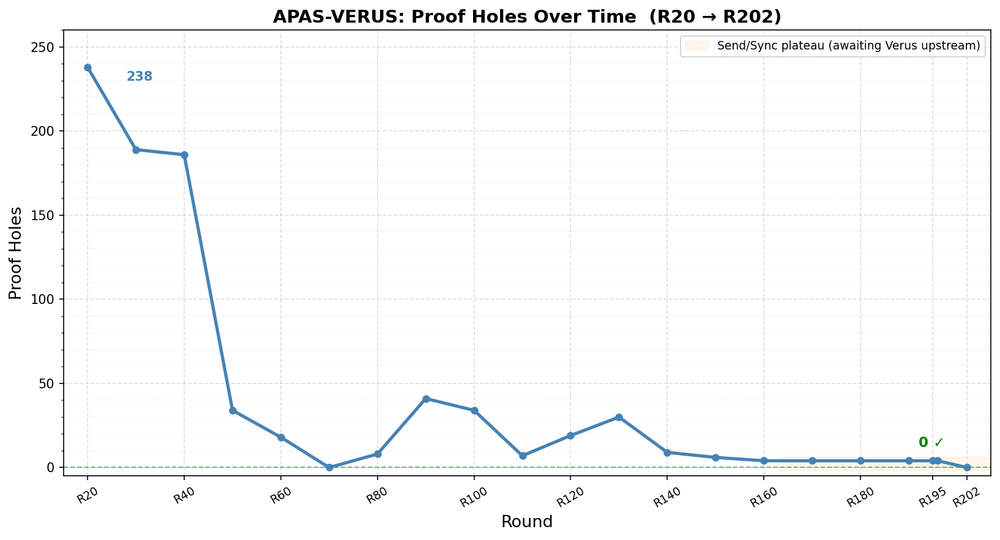
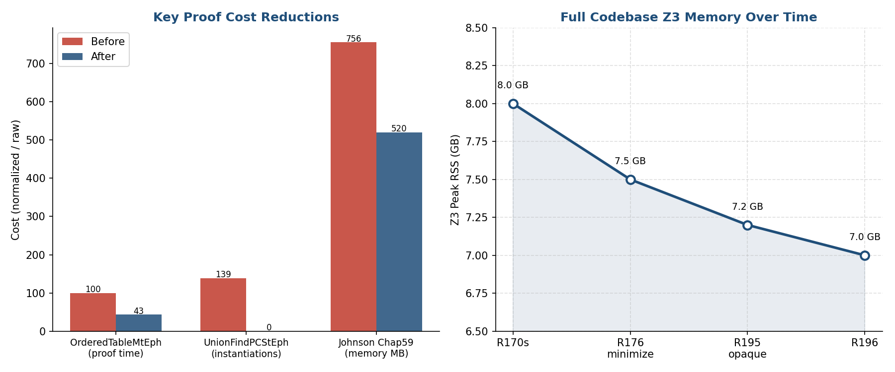

# APAS-VERUS: AI Paired Proof Engineering Techniques and Experience

- Brian G. Milnes <briangmilnes@gmail.com>
- Experience, Results and Techniques in building
- Algorithms Parallel and Sequential by Acar and Blelloch
- in Rust
- and then proving it in Verus.
- Or **What Can We Prove Today and for How Much?**
- And **Can Proof In-The-Large Save Computer Security?**
- https://github.com/briangmilnes/{APAS-VERUS,APAS-AI}

# Outline of the talk

- Its a pleasure to speak here at the Topos Institute.
- My Background
- Algorithms Parallel and Sequential (APAS)
- Rust      - The Good, The Bad and the Ugly
- APAS-AI   - AI Paired Programming APAS in Rust
- Rusticate - sending Python back to the family estate
- Verus     - Proving Rust

# Outline of the talk

- APAS-VERUS - AI Paired Proving APAS in Verus
- Veracity - Software Engineering AI Paired Proving
- Software Engineering in AI Paired Proving
- CPR$ - how to measure costs and my costs
- How bad is our computer security?
- How much Proof do we need to save computer security?
- Review of the Talk
- Questions

# Background

- B.Sc. Applied Math (Computer Science), Carnegie Mellon
- 2 years of AI PL development (Carnegie Group), my first startup.
- 7 years of (symbolic) AI Research (Soar Group, CMU CS)
- 2 years of PL research (Fox Group, CMU CS) aimed at
 making type safe languages work in systems and networking.
- Founding member of Lycos - systems, performance, ran operations
- Early Amazon - systems, performance, operations
- M.Sc. Computer Science, University of Washington
- Early Zillow - 6th engineer, ran operations, systems, performance
- A general love of proving programs with Rocq, F* and now Verus.

# Algorithms Parallel and Sequential (APAS)

- I chose to implement: Algorithms Parallel and Sequential (APAS) in Verus.
- Umut Acar and Guy Blelloch 2022
    - 121 algorithms!
    - 81 of which can be parallel.
    - 740 concepts.
- Not only is it a great textbook but it proved with very few changes needed!
- A few months ago Zach Tatlock was on a call with Sandia National labs.
- They said: "You can't prove algorithms like that!" 
- He pointed them to APAS-VERUS and my linkedin racked up 1200 views.

# Rust - The Good

- 20 year old PL
- Fast compilation, code.
- Industrial acceptance: AWS, Google, Huawei, Microsoft, and Mozilla.
- Linux Kernel now uses it!
- Linear typing plus borrowing! No GC!
- Clear mutability.
- Slicing! with ownership.
- Their 'cargo' package system works rather well.
- No objects for modularity! Good.

# Rust - The Bad

- No GC! Circular structures require GC and why not have it!
- No regions, just lifetime with end of scope deallocation which is slower.
- Translating C to Rust is hard to get it into linear logic + borrowing.
- However, you can (and I have) rewritten algorithms with a free list (that are right).
- Macros, with typing checked at use, which is not so good.
- Rust terminology is random.

# Rust - Typeclasses are a weak module

- You get basic module with pub/pub(crate) and no-pub.
- You get typeclasses which MUST be implemented at type.
- The Rustaceans have decided that unless their module implements a typeclass at
  multiple types, they won't use it.
- So reading Rust is every bit as scattered as reading C.
- Verus is now doing this also, but I ABUSE the notation to put all the specs
 together in APAS-VERUS for readability.
- You may pine for ML modules!

# Rust - The Ugly — Equality and Ordering

| Property         | PartialEq | Eq  | PartialOrd | Ord |
|------------------|-----------|-----|------------|-----|
| Reflexive        |  NO!      | req | NO! on leq | yes |
| Symmetric        | req       | req |            |     |
| Transitive       | req       | req | req        | req |
| Antisymmetric    |           |     | req        | req |
| Total            |           |     |            | req |
| Consistent w/ == |           |     |            |     |

# Rust - The 'unsafe' State

- In theory Rust marks unsafe code with 'unsafe' 
 and allows ptr arithmetic and other unsafe operations only inside this.
- In practice Rust allows at least 10 unsafe operations in 'safe' code.
- The most mind boggling attitude is that basic data structures can
 be considered 'safe' and LOSE YOUR DATA.
- Vec, VecDeque and BinaryHeap amongst others.
- To emphasize this I wrote 'Rust Seal' which did a lazy repair on
 these cases for a few percent costs on Rust's own benchmarks.
- https://github.com/briangmilnes/RustSeal
- It is RATHER hard to prove your algorithm if it's allowed to drop
 all your data.

# Rust - the State of the Semantics 

- Rust jumped ahead of any languages formal semantics with 
 linear semantics of ownership, borrowing and re-borrowing.
- They felt this was required for low-level systems and it is nice and fast.
- But that left us with formal semantics now playing catch-up.
- And we almost have:
    - Timany, Amin, et al. "A logical approach to type soundness." Journal of the ACM 71.6 (2024): 1-75.
    - Jung, Ralf, et al. "RustBelt: Securing the foundations of the Rust programming language." 45th ACM POPL 2018
    - Hance, Travis, et al. "VerusBelt: A Semantic Foundation for Verus’s Proof-Oriented Extensions to the Rust Type System." PLDI (2026): 1962-1986.

# APAS-AI   - AI Paired Programming APAS in Rust

- APAS-AI is a nearly complete, idiomatic Rust implementation of
     the algorithms from Acar and Blelloch.
- Sequential and parallel variants throughout.
- Timeline: 347 commits over 88 calendar days (Aug–Oct 2025).
- 59 days of active development; 8 residual commits in November.
- I knew no AI paired programming when I started.
- I knew no Rust when I started.
- My AI had to teach it to me, which was harder than I thought as
  of the 94 terms used in the Rust language and docs, only 4 are
  real PL terms!

# APAS-AI   - AI Paired Programming APAS in Rust

- Scale:
    - 42 chapters
    - 238 source files
    - 45,485 source LOC.
- Tests:
    - 246 files
    - 55,223 LOC
    - 3,923 test functions
    - 1.2× the source code size which is heavy.
    - Tests are now so cheap and automated, I generally don't count them.
- Benchmarks: 171 files, 13,890 LOC, 360 benchmark functions

# Verus: Verified Rust

- Verus is a tool for formally verifying Rust,
     developed at MSFT Research, VMware Research and Carnegie Mellon University.
- Team: Andrea Lattuada, Travis Hance, Chris Hawblitzel, Jay Lorch,
     Matthias Brun, Chanhee Park, Yi Zhou, Jon Howell, Bryan Parno.
- Goals: bring machine-checked proof to systems software written in Rust.
- Goals: *tight integration with the programming language*.
- Goals: easier faster proof.

# Key Verus Publications

- "Verus: Verifying Rust Programs using Linear Ghost Types"
     Lattuada, Hance, Cho, Brun, Subasinghe, Zhou, Howell, Parno, Hawblitzel
- "Verus: A Practical Foundation for Systems Verification"
     Lattuada, Hance, Bosamiya, Brun, Cho, LeBlanc, Srinivasan, Achermann,
     Chajed, Hawblitzel, Howell, Lorch, Padon, Parno
- "Verifying Concurrent Systems Code"
     Travis Hance — PhD Thesis, Carnegie Mellon University, 2024

# Verus

- Specifications are written in a pure **First Order Logic**.
- spec functions, forall/exists, arithmetic, sets, sequences.
- Undecidable.
- Z3 SMT handles linear arithmetic, arrays, and quantified formulas,
     but quantifier instantiation requires explicit trigger annotations.
- Z3 is NOT building certified proofs for Verus (but cvc5 might be coming).
- Wraps existing Rust code: - spec / proof / requires / ensures on fns
- Linear Logic + Borrowing from the Rust type system, which rustc checks.
- The TCB then is Verus+Z3+Rust+Libs, which is easily **= 2 M LOC**.

# Views and the Libraries

- A View maps an executable Rust type to a mathematical ghost type:
     "Vec<T> views as Seq<T>",  "HashSet<K> views as Set<K::V>".
- Specs are written over the view; exec code manipulates the real type.
- vstd is Verus's standard library — specs for Vec, Seq, Set,
     Map, Multiset, arithmetic, common lemmas, Fns ...
- Ghost types live only in the verifier —
     they have no runtime cost and no runtime representation.

# UnDirGraphStEph — Data Struct + View 

\scriptsize

```rust
#[verifier::reject_recursive_types(V)]
pub struct UnDirGraphStEph<V: StT + Hash> {
    pub V: SetStEph<V>,
    pub E: SetStEph<Edge<V>>,
}

impl<V: StT + Hash> View for UnDirGraphStEph<V> {
    type V = GraphView<<V as View>::V>;
    open spec fn view(&self) -> Self::V {
        GraphView { V: self.V@, A: self.E@ }
    }
}
```

\normalsize

# UnDirGraphStEph — Trait {.shrink}


\scriptsize

```rust
pub trait UnDirGraphStEphTrait<V: StT + Hash>:
    View<V = GraphView<<V as View>::V>> + Sized
{
    open spec fn spec_neighborhood(&self, v: V::V) -> Set<V::V>
        recommends spec_graphview_wf(self@), self@.V.contains(v)
    { Set::new(|w| self@.A.contains((v,w)) || self@.A.contains((w,v))) }

    fn neighborhood(&self, v: &V) -> (nbrs: SetStEph<V>)
        requires spec_graphview_wf(self@), self@.V.contains(v@), ...
        ensures  nbrs@ == self.spec_neighborhood(v@), nbrs@ <= self@.V;
}
```

\normalsize

# UnDirGraphStEph — Impl: `neighborhood` exec body {.shrink}


\scriptsize

```rust
fn neighborhood(&self, v: &V) -> (nbrs: SetStEph<V>) {
    let mut nbrs: SetStEph<V> = SetStEph::empty();
    let mut it = self.E.iter();
    let ghost edges_seq = it@.1;
    loop
        invariant nbrs@ == Set::new(|w| exists |i|
            0 <= i < it@.0 && /* edges_seq[i] hits v on either side */ ...),
        decreases edges_seq.len() - it@.0,
    {
        match it.next() {
            None    => { proof { /* set-equality lemmas */ } return nbrs; }
            Some(e) => { /* if feq(&e.0,v) insert e.1; sym. */ ... }
        }
    }
}
```

\normalsize

# Wrapping Rust — Declaring an external type

- Four specification constructs are used to give specs to Rust stdlib.
- A proxy struct that introduces a spec for a foreign type.
- The proxy struct name is conventionally ExTypeName.
```rust
  #[verifier::external_type_specification]
  pub struct ExVec<T>(Vec<T>);
```

# Wrapping Rust — Declaring an external function/method

-  A proxy function with the same signature as the foreign function, carrying the
   requires/ensures.
```rust
  #[verifier::external_fn_specification]
  pub fn ex_vec_push<T>(v: &mut Vec<T>, value: T)
      requires v@.len() < usize::MAX,
      ensures  v@ == old(v)@.push(value),
  { v.push(value) }
```

# Wrapping Rust — Declaring an external function/method
  - Add a View and specs to a foreign type.
```rust
  #[verifier::external_type_specification]
  pub struct ExHashMap<K, V>(HashMap<K, V>);
  impl<K,V> View for ExHashMap<K,V> {
       type V = Map<K::V, V::V>;
       spec fn view(&self) -> Map<K::V, V::V>;}
```

# Wrapping Rust — external\_trait\_specification

  - Adds a spec to a foreign trait without modifying it:
  ```rust
  #[verifier::external_trait_specification]
  pub trait ExClone: Sized {
      type ExternalTraitSpecificationFor: core::clone::Clone;
      fn clone(&self) -> Self;
  }
  ```
  - The proxy trait name is `Ex<TraitName>` by convention.
  - Add `requires`/`ensures` to the method to give it a full contract.
  - Limitation: no generics.

# Tokenized State Machines — Hance, CMU 2024

- Problem: Rust's ownership types handle sequential aliasing well
     but cannot express distributed protocol state across threads.
- Answer: A Tokenized State Machine defines protocol state as fields
     with sharding strategies (variable, map, count, storage_option…).
- Transitions and an inductive invariant are proved once, globally.
- Verus auto-generates ghost token types and exchange functions
- This has now been generalized to partial commutative monoids.

# APAS-VERUS - AI Paired Proving APAS in Verus

- Goal: formally verify all algorithms in Acar and Blelloch
    - Every algorithm gets a machine-checked proof
    - no admitted lemmas,
    - no hand-waving in production code.
- 44 chapters, 262 algorithm files, upto 4 variants per algorithm:
     StEph (sequential mutable), StPer (sequential persistent),
     MtEph (parallel mutable), MtPer (parallel persistent).
- Minimal use of Rust std.
- But as you'll see I had to write some axioms and admit a class of
 functions.

# APAS-VERUS - AI Paired Proving APAS in Verus

- 26 vstdplus library modules, mostly making Views.
- 29 standards documents encoding project proof conventions,
- Verification is the primary goal.
- Runtime tests (RTT) and proof-time tests (PTT) are secondary,
   but still terribly useful.
- They both still catch errors and instruct the AI.

# APAS-VERUS — Quantitatives

- Scale: 44 chapters, 262 files, 186,223 src LOC (not counting comments).
- With vstdplus, standards, RTT, PTT: 275,014 total LOC.
- Built in 160 days, 2,596 commits, 8 agents, 281 agent-round reports.
- Verification: 5,674 verified proof obligations, 0 errors.

# APAS-VERUS: Full Validation Cost (2026-04-12)

  - Elapsed:          210s on a 12 core notebook
  - rust_verify RSS: 10,278 MB  (~10 GB)
  - Z3 RSS:           6,874 MB   (~6.7 GB)
  - rust_verify CPU: 216s
  - Z3 CPU:           265s
- But I have had Z3 jump up to as much as 28 GB when I write bad proofs.
- Somewhere in it I suspect there is a novel formal verification of some algorithm.

# APAS-VERUS — Quantitatives

- Holes: started at 238 (R20), now 0 but it's out of date with Verus.
- Largest chapter is the forest: Chap37 - AVL trees, BST variants - 20,319 src LOC.
- 2 × more source code to verify than APAS-AI needed to implement.
- Start: 2025-11-03
- End  : 2026-04-12
- Duration: approximately 150 calendar days

# APAS-VERUS -

- Spec    32,868  (21%)
- Proof   42,251  (27%)
- Exec    67,883  (44%)
- Rust    12,206   (8%)   plain Rust (outside Verus!)
- The "rust" 8% is code outside Verus! — Debug impls, macros, cfg, etc.
- All proof to exec: 75,119 / 67,883 = 110%.

# APAS-VERUS: The Pain Points

- When I started Verus, iterators for collections took quite some time.
- Generics and Equality was the second big pain point.
- I still have full equality axioms for generic types.
- Closures took a good bit of work.
- Ordering was and is still difficult, it made my UnionFind consume up to 28GB in Z3.
- Verus is so fast, even with bloated AI proofs, I didn't profile much until
 I was in the last few chapters.
- I simply made validate isolate by chapters.
- Verus is moving quickly and most of these pain points have been addressed.

# AutoCLRS

- AutoCLRS is Swamy et al. and AIs implementation: "Introduction to Algorithms, 4th ed" 2022
- by Thomas H. Cormen, Charles E. Leiserson, Ronald L. Rivest, and Clifford Stein in F*/Pulse.
- RISE MSR blog (2026-03-06) says the initial 10K lines came "very quickly" and then
"about a month of nudging" to reach 100K LOC.
- Nikhil Swamy with thanks to Gabriel Ebner, Lef Ioannidis, Guido Martinez, Matthai Philipose and Tahina Ramananandro.
- They have a dependent type theory but prove about 12 times slower which they work around nicely
 with incremental and parallel proofs through a server.
- They did a formal specification of algorithmic complexity with step counting.

# Rusticate and Veracity- Software Engineering AI Paired Proving

- I first built a toolset call Rusticate for APAS-AI.
- Everything one can do in programmatic SE, I try and do in programmatic SE.
- The follow on tool for APAS-VERUS is Veracity, a suite of 22+ tools for analyzing, reviewing, and
     fixing Verus codebases.
- Review tools:
    - proof holes (assume, external_body, admit),
    - style enforcement (21 rules, auto-reorder),
    - with spec strength classification fed to AI,
    - veracity-count-loc (spec/proof/exec breakdown),
    - chapter-cleanliness-status (clean vs. holed chapter summary vs blocked by),
    - string-hacking detector, function inventory, etc.
- One of the best is veracity-minimize-proofs
- Heck, I had to run the string hacking detector on the string hacking detector.

# Veracity- Software Engineering AI Paired Proving

- Search: veracity-search — type directed search over vstd
- VERUS by type signature, finding lemmas before writing new ones.
- "Specifications as Search Keys for Software Libraries"
     Eugene J. Rollins and Jeannette M. Wing
- Written for my sins of asking why does Verus vstd not have X? when it did!
- Even more useful for my AIs's seriously disturbing sinning.
- This allowed me to download ALL known Verus (git VerusCodebases)
    and have my AI search them in 1.2 seconds!

# APAS-VERUS - Complexity

- APAS states complexity and informally proves many of them for some algorithms.
- So I wrote a programmatic tool to find and list mismatches.
- Then I had Claude Opus do it's analysis and compare every function
  with the textbook's.
- This found 16 faults in parallel algorithms.

# APAS-VERUS: Experiments

- Agents often say "Verus Can't Do That"
- I said "Make an experiment!"
- Quantitatives:
    - 168 experiment files
    - 21,476 lines of code (not counted in the totals)
- Topics span: Clone, Arc, RwLock, TSM, closures, iterators,
 generics, float, bitvector, PartialEq, Copy, async, hash tables,
 parallel algorithms, ghost types, Send/Sync, collect, and sorting.
- 168 experiments, 107 successes, 61 Verus limits.

# APAS-VERUS Standards

- I finally built a set of coding standards in Verus rust files and in comments.
- Agents read all standards before every task (~6,200 lines, ~54K tokens)
- Violations are mostly AI checked except where an extensive code styling
  can get things.
- Quantitatives:
    - 29 standard files
    - 6,911 lines total
- Doing this earlier would have really sped things up.

# Taking Claude to CS classes

- In order to make Claude opus-4.8 work, I had to take it to CS classes.
    - https://github.com/briangmilnes/ComputAItionalThinking 
    - ala Wing CACM Vol. 49 num 3, 2006
- I described computational thinking and the agent's roles.
- I had my agent read and generate vocabulary over about 30 open classes.

# Taking Claude to SE process

- Although APAS-AI and APAS-VERUS were developed without a formal SE process
- I eventually settled into a style and taught it to my AIs
- In medicine: GRASE (Medical Acronym) - Generally Recognized as Safe and Effective
- In SE: GRASE - Git Recording Agentic Software Engineering
- https://github.com/briangmilnes/GRASE
- Agents are now hiding more and more of their thinking, even encrypting their messages to subagents.
- GRASE pushes them into fixed plans, reports, logging and analyses which gives you more understanding and control.

# Veracity: AIs Write Redundant Proofs

- AI proof agents produce many correct but bloated proofs.
- So I wrote a proof minimizer: veracity-minimize-proofs.
- It tests each assert and proof block
     individually: removes it, re-verify, comment it out if it is
     not needed and it does not increase time or memory.
- One assert in Chap43 OrderedTableMtEph saved:
    - 104 s of Z3 CPU
    - up to 89 MB of Z3 RSS per verify run.
    - Eight removals Z3 RSS dropped by 57%.
- 105 minutes of running the minimizer bought many hours
 of validation drop.

# Proof Holes Over Time — R20 to R201



# Proof Time and Memory — Key Reductions



# Proof Time and Memory — Key Reductions

- Five techiniques were used to optimize
    - minimize-proofs
    - profiling
    - splitting specs and applying them just where they are needed
    - opaque       - to hide a definition within the module
    - private spec - to hide a definition across modules
- OrderedTableMtEph: −57% proof time after minimize-proofs (R176).
- UnionFindPCStEph: 139K Z3 instantiations → 0 after opaque pattern used in
 a required module.
- Johnson Chap59: 756 MB → 520 MB (−31%) memory reduction.

# CPR$ — Three Numbers and One Ratio {.shrink}

| # | Sym    | Name          | Measures                                                           |
|--:|:-------|:--------------|:-------------------------------------------------------------------|
| 1 | C      | Cost of Code  | $ to produce executable code                                       |
| 2 | P      | Cost of Proof | $ to produce specs, contracts, and proofs                          |
| 3 | C+P    | Total         | Full bill for the verified artifact                                |
| 4 | R      | Review Ratio  | Fraction of deliverable a proofgrammer must read (LOC0R excluded)  |

# Proofgrammer/AI Costs

- **Programmer rate**: $375,000/yr (senior + 50% loading)
- **Real AI spend**: < $7,000 across the whole effort
- **Derived --ai-costs**: $4.886/hr × 1,760 = **$8,599/yr**
- **AI split by task-hours**: 
    - 21.6% APAS-AI ($1,512)
    - 78.4% APAS-VERUS ($5,488)

# Proofgrammer/AI Costs

| # | Project     | Hours | KLOC  | KLoEC | KLOPC2R | KLOC0R |
|---|:------------|------:|------:|------:|------:|--------|
| 1 | APAS-AI     |   309 |  31.8 |  31.8 |    —  |   —    |
| 2 | APAS-VERUS  | 1,123 | 166.4 |  56.5 |  47.8 |  95.9  |
| 3 | Combined    | 1,432 | 198.2 |  88.3 |  47.8 |  95.9  |

# CPR$ — Combined Result

| # | Quantity                         | Value         |
|:---|:------------------------------|:--------------:|
| 1 | C — Cost of Code               | **$150,723**  |
| 2 | P — Cost of Proof              | **$161,594**  |
| 3 | LOP/LOC                        | **1.08**      |
| 4 | C + P — Total                  | **$312,317**  |
| 5 | $ / KLines                     | **$1,877**    |
| 6 | C / KLOE                       | **$2,665**    |
| 7 | P / KLOP                       | **$6,305**    |
| 8 | R — Review Ratio               | **~33.3%**    |

# Head-to-Head — seL4 (2009) vs APAS-VERUS — 22.5 py base {.shrink}

| #  | Quantity         | seL4 (pre-AI) | APAS-VERUS | Ratio           |
|:--:|:-----------------|--------------:|-----------:|----------------:|
|  1 | Person-years     |          22.5 |       0.64 | seL4 ~35×       |
|  2 | Hours            |        46,800 |      1,123 | seL4 ~42×       |
|  3 | KLOE             |            10 |      ~ 57  | Verus ~5.7×     |
|  4 | KLOP             |           480 |      ~ 110 | seL4 ~4.4×      |
|  5 | KLOP / KLOE      |            48 |      ~ 1.9 | seL4 **~25×**   |
|  6 | KLines / hour    |        0.0105 |      0.148 | Verus ~14×      |
|  7 | $ / KLOE         |     $ 843,750 | ~ $ 4,300  | seL4 **~196×**  |
|  8 | $ / KLOP         |      $ 17,578 | ~ $ 2,225  | seL4 ~7.9×      |
|  9 | C + P total      |   $ 8,437,500 |  $ 244,840 | seL4 **~34.5×** |

# R

- LOPC2R = Lines of proven code 2 review
- LOPC0R = Lines of proven code not to review
- R = LOPC2R / (LOPC2R + LOC0R)
- 47,828 / 143,736 = 0.332749 = 33.2749 %
- R — Review Ratio **~33.3%**

# Software Engineering in AI Paired Proving- Problems

- What is the limiting factor now? **Code Review!**
- But really **Spec Review** when you prove.
- What can we do to simplify code review?
- 1. Modularity - traits/impls in Verus.
- 2. TOC     - This organizes the boilerplate to make reading easier.
- 3. Proof   - I really just read the specs. If they're right the code
 is right!
- 4. Tests   - are hugely useful when you don't trust your coding team.
- 5. Formatting - rust formatting has been adopted in Verus. It is very
  low density. I built a minimizing formatter to cut down on my working
  memory load while reviewing. F* is much tighter.

# Quantitative SE: What Rust Cargos use in std.

- I downloaded the 1036 most downloaded Rust projects, 3636 crates.
- Top 1000 projects, 3636 crates.
- 48 data types fully support 100%.
- 79 modules fully support 99%.
- 1733 methods fully support 99%.
- 14,317 total fn definitions in std/core/alloc in Rust
- 4,965  pub fn definitions   in std/core/alloc in Rust
- But how many of those private functions do we need? I don't know.

# Compare Rust Libs to APAS-VERUS?
- APAS-VERUS:
    -6,401 exec functions total,
    -4,911 with proofs
- But APAS-VERUS has {Mt,St}x{Per,Eph}
- So it is much more like 2000 distinct functions.
- And I wrote this in 160 days while learning Verus.
- At least 30 of those days were understanding and working around pain points.

# How bad is our computer security?

- Linux kernel team publishes 432 CVEs in two days 22 July 2026
- Linux can't handle this with their current process.
- How many are really human verified not AI new CVE injections?
- What happens when they try and make 432 changes one by one?

# Mythos Audit Rust vs Firefox 
  
| # | Metric                | Rust (Compiler/Std) | Firefox (Entire Codebase) |
|---|-----------------------|---------------------|---------------------------|
| 1 | Codebase Size         | ~4,500 KLOC         | ~40,000 KLOC              |
| 2 | Mythos Bugs Found     | 189                 | 271                       |
| 3 | Vulnerability Density | 0.0420 bugs/KLOC    | 0.0068 bugs/KLOC          |
| 4 | Ratio                 | **6.18**            |  1                        |

# How much Proof do we need to save computer security?

- As a spreadsheet style thought experiment, I collected examplars of proven/required
systems and their LOP and LOC. 
- And put a $2000/KLOC to generate Rust LOC in it and $2000-8000/KLOP at 110% scaling.
- What do we rewrite? Prove? 

# The Exemplars

-  One measured system per artifact — **bold** = carries a machine-checked proof
- **Semantics** — **Rocq** · **CoqQFBV** · **cake_lpr** · **Iris** · **RustBelt**
- **PL** — **CompCert** · **CompCertELF** · **CakeML GC**
- **Std Library** — Rust core · **VST malloc** · **CakeML basis** · **HACL\*/EverCrypt**
- **OS boot** — U-Boot · **DICE\***
- **OS core** — **Atmosphere** · Asterinas OSTD/OSDK · Linux net/ · **FSCQ**
- **OS devices** — Linux drivers/base · **Pancake i.MX8 NIC** · **SeKVM** · **Vigor/Klint**
- **Utilities & Apps** — Unbound · chrony · BusyBox · Suricata · nginx · Redis · SQLite · NGINX Unit
- **Distributed & POP** — **CapybaraKV** · S3 ShardStore · **Verdi raft** · FoundationDB · git · **Verus (vstd)** · cvc5

# Cost of Proving 'Everything' You Need for Security

| Section              | Unproven | Proven | Proofs |  Total |
|----------------------|---------:|-------:|-------:|-------:|
| 1 Semantics          |    3,000 |    228 |    252 |  3,480 |
| 2 PL                 |    8,173 |    178 |    206 |  8,557 |
| 3 Std Library        |    1,178 |    148 |    135 |  1,461 |
| 4 OS                 |    1,594 |     19 |    107 |  1,720 |
| 5 Utilities          |      879 |      0 |      0 |    879 |
| 6 Application Stack  |      579 |      0 |      0 |    579 |
| 7 Distributed Svcs   |    3,283 |     24 |     47 |  3,354 |
| 8 Proof of Programs  |      500 |      2 |     38 |    540 |
| **Total**            |**19,186**| **599**| **785**|**20,570**|

# 20,570 KLOC · $90.9M · 3.0% example proven today

- $2,000/KLOC to write · 1.1 proof lines per line · $2,200/KLOP to prove

| Estimated cost of Total KLOC        |    $41,140,000 |
| Estimated cost of Total Proven KLOC |     $49,779,400 |
| **Estimated Total Cost**            | **$90,919,400** |

# The Enemies of Proven Code

- Proven Formal Semantics - we are getting close.
- Code bloat: Rust's Libs are a great example!
- Will AIs just brute force the security problems?
- Features - how much is enough?
- The Innovator's Dilemma - would MSFT, Amazon, ... do this?
- Complexity: how much can we really specify?
- Going type safe we get about 70% bug reduction.
- Is FOL enough?
- Proving code, do we get 90%? 95% Is that enough?

# Review of the Talk

- We've talked about:
    - APAS, Rust, APAS's implementation in Rust.
    - My Quantitative SE approach in Rusticate and Veracity.
	- SE in AI paired proving
	- CPR$ What does it really cost to write proven systems?
	- How bad is our computer security?
	- And how much Proof do we need to save computer security?
	
# Questions	

- I'd like to know who is proving math in the audience?
- Is it foundational proof?
- Which agents are working well for you, which are not?
- Is anyone proving algorithms in Lean?
- Is anyone proving programs?
- Is anyone proving PL semantics?
- What happens when you use a generative style like F*/Pulse 
 vs a close to the PL style?
